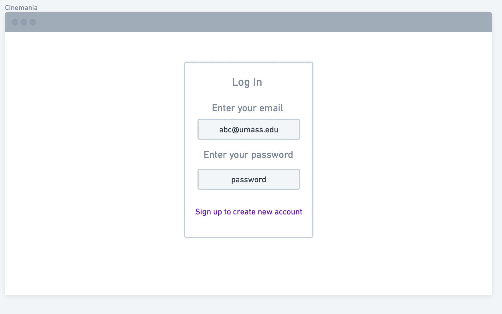
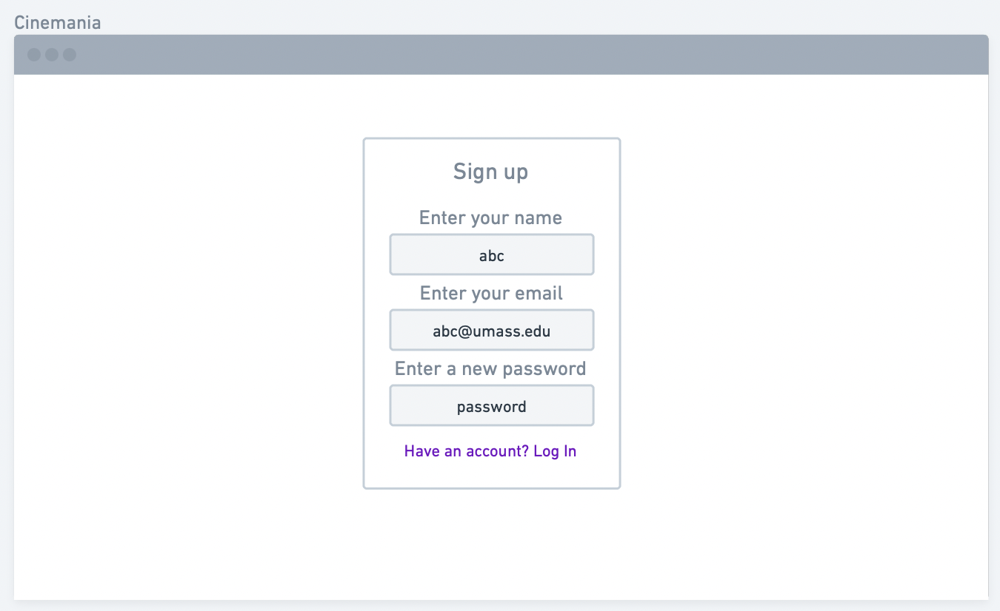
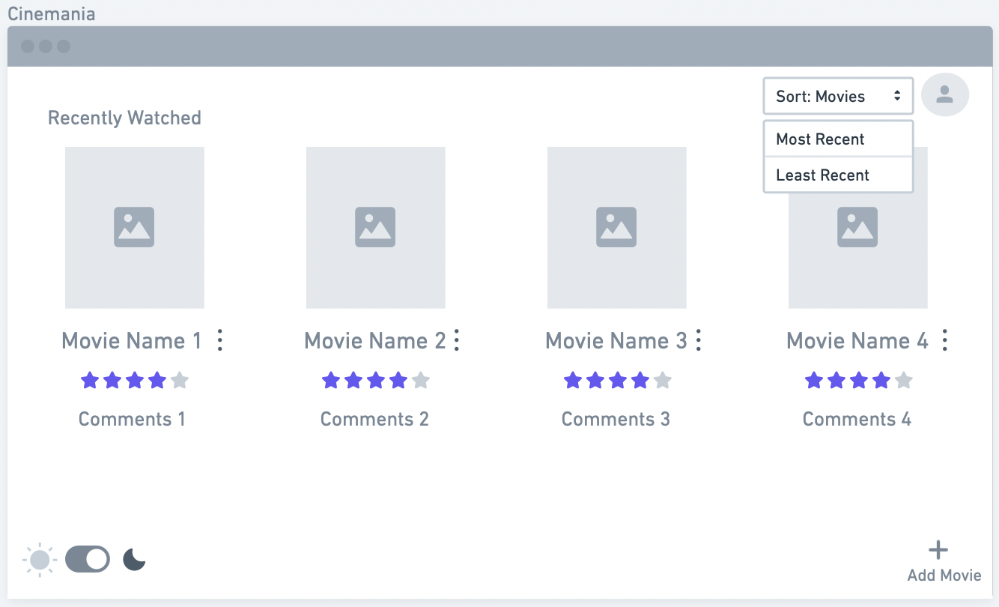
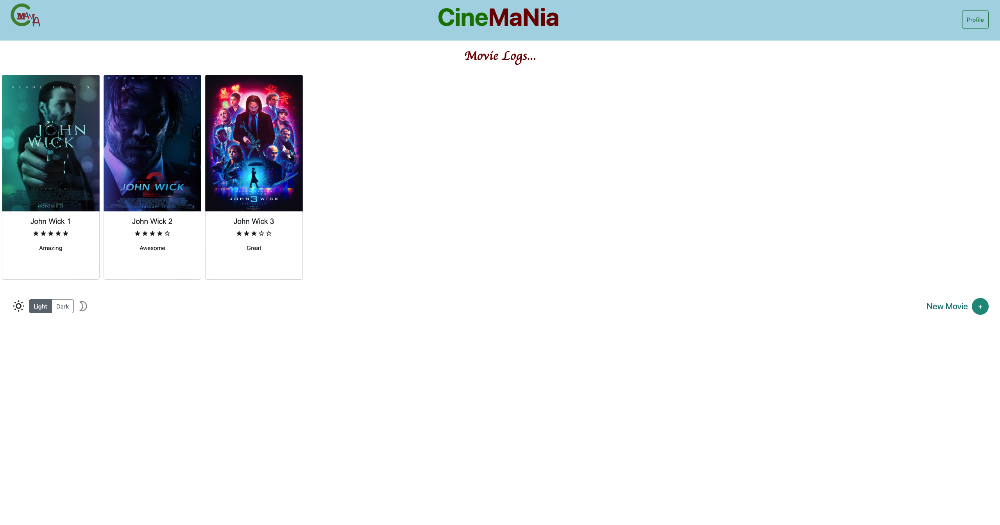
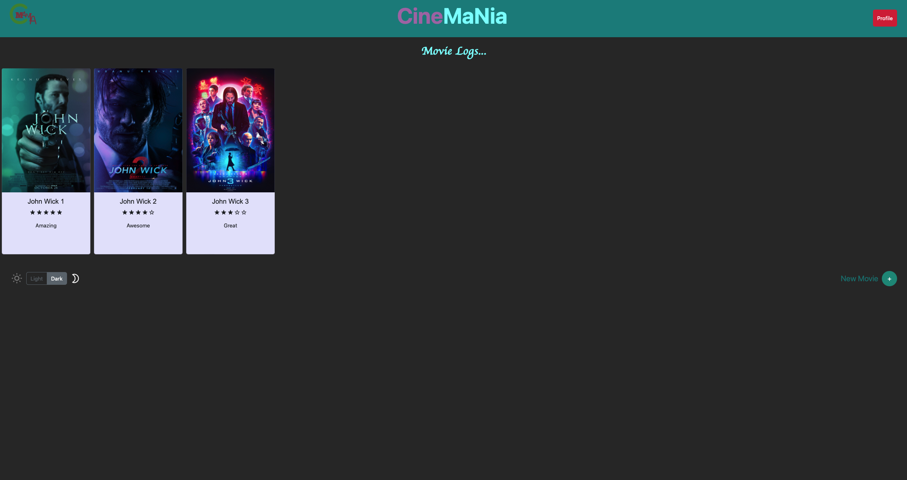
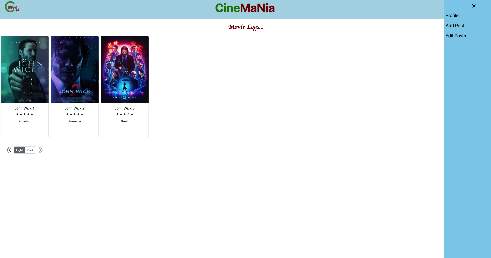
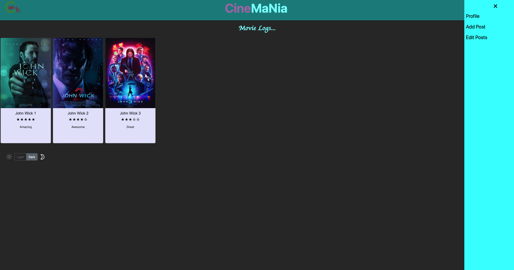

# UI Design

## Wireframe

We explored all the different objects suggested, but found whimsical to be the most efficient as per our needs, hence, decided to build our prototype using that.

We decided to stick with a minimalist approach, and decided to keep the color palette to be neutral for now to maintain the aesthetic and also because having a neutral palette right now would motivate us to explore our other options later on.

We decided to have only those features which have an actual functionality in real life keeping in mind Schneiderman's Design principles (HCI).

Our first page is the landing page that would allow us to login into out webapp using email and password for current users. It would also have an option to create a new account if the user has never been registered before.

This is our page to create a new account using user's name, email and password, and if they already exist in the system, they can go back to the login page from here as well.

Our third image basically shows the main page of our webapp which shows the list of recently watched movies, has an option to sort this list based on most recent and least recent. It has an option to add more movies, has a functionality to switch between light (represented by sun) and dark mode (represented by moon), and has a profile button as well.

Our fourth image explains about the dotted menu functionality that allows the user to delete the movie, delete the comment, edit movie name, edit the comment and upload a new image which represents the movie. It also shows the profile, where one can see their name and email linked with that account. 

## Stories

## Story 1

When the user opens the app they will see a login box where they will need to enter their login credentials like user email and password. If they have not yet signed up,they would click the button that says "Sign up to create new account". This story gives an example of how the user can use the website based on the Wireframe1.png

## Story 2

If they have not signed up yet and have clicked the "Sign up to create new account" they would be directed to a page with a box that says Sign up. The prospective user would be instructed to enter their name, email and a password. After that they would have access to Cinemania. This story gives an example of how the user can use the website based on the Wireframe2.png

## Story 3

When the user succesfully gains access to the web app, they are greeted by a page where they can see their previous added movies, if they are a returning user. If not, the page is empty however they can add new movies with using the add new movie button by the down right corner of the page. On the down left corner of the page they can change if they want to use the website in dark or light theme so the user would decide on that. After adding the movies one by one the user could sort the movies based on when they they added, from most recent or least recent. The users can also see how many stars the movies has based on the users previous rating and how many comments the user wrote for that movie. They can also click the profile button on the top right corner to acces their profile page if they wanted to update their settings. This story gives an example of how the user can use the website based on the Wireframe3.png.

## Story 4

If the user wanted to delete a movie they added previously they would click on the dotted menu that is located
next to the movie's name. When they click on that button they can see all the options to delete a movie, delete their comments, edit the movie name, edit their previous comment and upload a new movie image. This story gives an example of how the user can use the website based on the Wireframe4.png.
  

## HTML and CSS Mockup

## Main Page

This is the main page the user will see when they open our website for the first time.

## Dark Mode

We have also added dark mode to the website. This is an example of how the main page would look like with Dark Mode enabled.

## Profile

The user can click on the right side to see their profile, add posts, or edit their previous posts.

 
