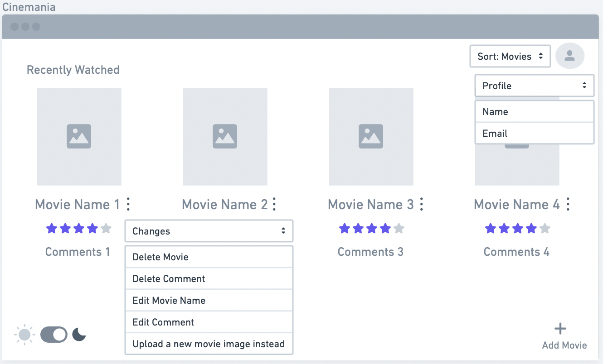

# UI Design

## Wireframe

We explored all the different objects suggested, but found whimsical to be the most efficient as per our needs, hence, decided to build our prototype using that. 

We decided to stick with a minimalist approach, and decided to keep the color palette to be neutral for now to maintain the aesthetic and also because having a neutral palette right now would motivate us to explore our other options later on. 

We decided to have only those features which have an actual functionality in real life keeping in mind Schneiderman's Design principles (HCI). 

Our first page is the landing page that would allow us to login into out webapp using email and password for current users. It would also have an option to create a new account if the user has never been registered before.

This is our page to create a new account using user's name, email and password, and if they already exist in the system, they can go back to the login page from here as well.

Our third image basically shows the main page of our webapp which shows the list of recently watched movies, has an option to sort this list based on most recent and least recent. It has an option to add more movies, has a functionality to switch between light (represented by sun) and dark mode (represented by moon), and has a profile button as well.

Our fourth image explains about the dotted menu functionality that allows the user to delete the movie, delete the comment, edit movie name, edit the comment and upload a new image which represents the movie. It also shows the profile, where one can see their name and email linked with that account. 

